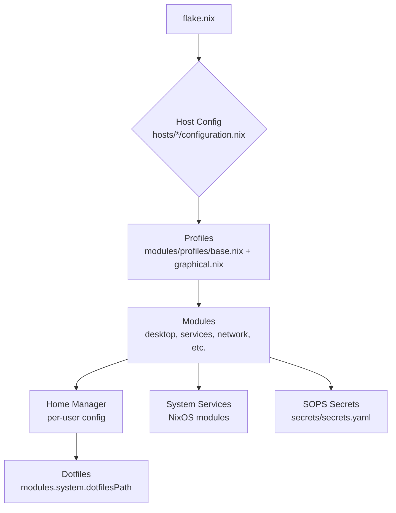
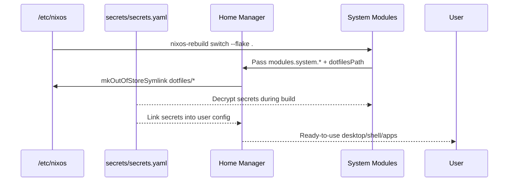

# System Architecture & Modularization

This project uses a highly modular structure to maximize code reuse across different hosts while maintaining flexibility.



## 1. Custom System Options (`modules/core.nix`)

We define custom NixOS options to abstract over specific user details and paths. This allows the configuration to be portable and configurable per host.

*   `options.modules.system.mainUser`: (String, default: `"bomba"`)
    *   The primary username for the system. Used to configure users, groups, and Home Manager. Override per host to match your login.
*   `options.modules.system.dotfilesPath`: (Path, default: `"/etc/nixos"`)
    *   The absolute path to the Git repository. Crucial for `mkOutOfStoreSymlink` to enable hot-reloading of dotfiles.

**Usage Example:**
```nix
# In a module
{ config, ... }:
let cfg = config.modules.system;
in {
  home-manager.users.${cfg.mainUser} = { ... };
}
```

## 2. Profiles (`modules/profiles/`)

Instead of importing dozens of individual modules in every host config, we use **Profiles** to aggregate common functionality.

### `base.nix`
The foundation for **all** systems (servers and desktops).
*   **Includes:** Core system settings, Zsh, Tmux, Neovim, SSH, GPG, Rsyslog, Docker.
*   **Usage:** Imported by server hosts and by the `graphical` profile.

### `graphical.nix`
The foundation for **desktop** systems.
*   **Imports:** `base.nix`.
*   **Adds:** Desktop environment (Hyprland), Avahi, Bluetooth, Audio.
*   **Usage:** Imported by workstation hosts.

## 3. Host Definitions (`flake.nix`)

The `flake.nix` file uses a helper function `mkHost` to reduce boilerplate.

```nix
mkHost = hostname: nixpkgs.lib.nixosSystem {
  # ...
  modules = [
    ./hosts/${hostname}/configuration.nix
    # ...
  ];
  specialArgs = { flake-self = self; ... };
};
```

## 4. Dotfile Management

We use a "Hot-Reload" strategy for user configuration.
Instead of copying files to the Nix Store (which requires a rebuild to change), we symlink them directly from the local repository path defined in `modules.system.dotfilesPath`.

**Mechanism:**
`config.lib.file.mkOutOfStoreSymlink "${cfg.dotfilesPath}/dotfiles/..."`

**Benefit:** You can edit a Waybar config or Hyprland rule in `dotfiles/` and see the change immediately (or after a service restart) without running `nixos-rebuild`.


