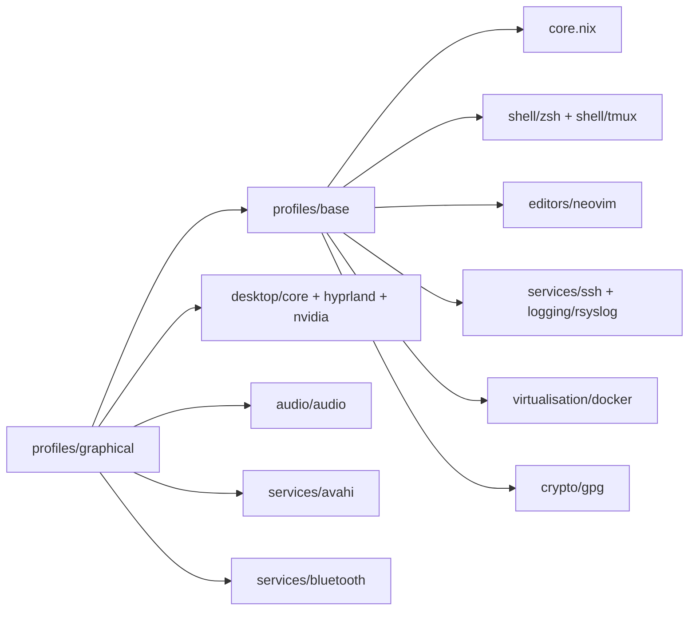

# Module Inventory

Quick reference for what each module does, what options it exposes, and where to use it.

## Profiles

| Module | Purpose | Usage |
| :--- | :--- | :--- |
| `modules/profiles/base.nix` | Aggregates core system pieces (Zsh, Tmux, Neovim, SSH, GPG, Rsyslog, Docker). | Import in any host; defines the baseline environment. |
| `modules/profiles/graphical.nix` | Desktop profile stacking Hyprland, Avahi, Bluetooth, GUI defaults on top of base. | Import in workstation hosts. |

## Core & System

| Module | Purpose | Options | Usage |
| :--- | :--- | :--- | :--- |
| `modules/core.nix` | Core defaults: users, locale, packages, sops secrets, Home Manager glue. | `modules.system.mainUser`, `modules.system.dotfilesPath`. | Imported by profiles; override options per host. |

## Desktop & UI

| Module | Purpose | Options | Usage |
| :--- | :--- | :--- | :--- |
| `modules/desktop/core.nix` | Common desktop apps/config (Waybar, Kitty, Wofi, GTK, cursors, wallpapers). | — | In graphical profile/hosts. |
| `modules/desktop/hyprland.nix` | Hyprland enablement plus host/mode-specific configs. | `modules.desktop.hyprland.{enable,mode,hostName}` | Set `enable = true` with hostName/mode in desktop hosts. |
| `modules/desktop/nvidia.nix` | NVIDIA drivers, container toolkit, udev rules, power cap. | — | GPU-equipped hosts. |
| `modules/desktop/gui-desktop.nix` | Plymouth splash + tuigreet login for desktops. | — | Desktop hosts needing a greeter. |
| `modules/desktop/gui-server.nix` | Minimal GDM/auto-login GUI for server-ish deployments. | — | Headless/console hosts needing a basic display manager. |
| `modules/desktop/fake-screen.nix` | Fake EDID/monitor for headless systems. | — | Remote/streaming setups needing a dummy display. |

## Services

| Module | Purpose | Options | Usage |
| :--- | :--- | :--- | :--- |
| `modules/services/ssh.nix` | Enable OpenSSH server. | — | Everywhere you need SSH. |
| `modules/services/avahi.nix` | Enable Avahi/mDNS. | — | LAN devices needing discovery. |
| `modules/services/bluetooth.nix` | BlueZ with tweaks and Blueman. | — | Bluetooth-capable desktops. |
| `modules/services/hp-printing.nix` | Printing with HPLIP + mDNS. | — | Hosts using HP printers. |
| `modules/services/sunshine.nix` | Sunshine streaming with CUDA and firewall openings. | — | Game/desktop streaming hosts. |
| `modules/services/hw-monitor.nix` | Periodic hardware telemetry (CPU/GPU temps, power, fans) via systemd timer. | `modules.services.hwMonitor.{enable,intervalSec}` | GPU/gaming hosts needing thermal data. |
| `modules/services/intune.nix` | Microsoft Intune + Identity Broker for corporate Linux workstation compliance (spoofs `/etc/os-release` as Ubuntu 24.04 during enrollment). | — | Hosts enrolling in a Microsoft Intune tenant. |
| `modules/logging/rsyslog.nix` | Forward logs to a central rsyslog receiver. Edit the destination IP/port in-module. | — | Hosts shipping logs centrally. |

## Networking & VPN

| Module | Purpose | Options | Usage |
| :--- | :--- | :--- | :--- |
| `modules/network/generic.nix` | NetworkManager + shared hosts entries (placeholder IPs — replace with your own LAN layout). | — | Roaming/desktop hosts. |
| `modules/network/home-lan.nix` | Home-LAN defaults (static gateway/DNS). | — | Hosts on a fixed home network with a local resolver. |
| `modules/network/waypipe.nix` | Install waypipe (Wayland app forwarding over SSH). | — | Hosts that forward/receive Wayland apps. |
| `modules/vpn/home-wireguard.nix` | **Placeholder.** Installs `wireguard-tools`; leaves the actual WireGuard config deployment as a TODO since secrets are per-user. Read the module header for the wiring recipe. | — | Template / reference only. |
| `modules/vpn/office-wireguard.nix` | **Placeholder.** Installs `wireguard-tools` + sccache config; leaves the actual office WireGuard config deployment as a TODO (sops-wired per-user). | — | Template / reference only. |

## Development & Tools

| Module | Purpose | Options | Usage |
| :--- | :--- | :--- | :--- |
| `modules/development/embedded-bsp.nix` | Comprehensive C++/Python toolchain (gcc, cmake, ninja, Python LSP) plus an NFS/TFTP netboot server for target boards. | — | Embedded BSP / firmware dev hosts. |
| `modules/development/segger.nix` | udev rules for Segger J-Link probes. | — | Embedded dev hosts. |
| `modules/games/minecraft.nix` | PrismLauncher install via Home Manager. | — | Hosts running Minecraft. |

## Shells & Editors

| Module | Purpose | Options | Usage |
| :--- | :--- | :--- | :--- |
| `modules/shell/zsh.nix` | Zsh with Oh My Zsh + powerlevel10k. | — | Default shell in base profile. |
| `modules/shell/tmux.nix` | Tmux with vim-style bindings, large scrollback, and custom status bar. | — | Included in base profile. |
| `modules/shell/fish.nix` | Fish shell with aliases/themes. | — | Hosts preferring Fish. |
| `modules/editors/neovim.nix` | Neovim with runtimes + dotfiles. | — | Default editor via base. |
| `modules/editors/vim.nix` | Classic Vim with plugins + dotfiles. | — | Alternative editor. |
| `modules/editors/emacs.nix` | Doom Emacs bootstrap/config. | — | Hosts using Doom Emacs. |

## AI & Virtualisation

| Module | Purpose | Options | Usage |
| :--- | :--- | :--- | :--- |
| `modules/ai/ollama.nix` | Ollama with CUDA acceleration, exposed on LAN (port 11434). | — | GPU hosts needing local LLM inference. |
| `modules/ai/open-webui.nix` | Open WebUI front-end backed by Ollama. | — | AI-serving hosts (optional). |
| `modules/ai/comfyui.nix` | ComfyUI container with GPU + storage bindings. | — | AI/image-generation hosts (optional). |
| `modules/virtualisation/docker.nix` | Docker daemon + user group. | — | Containers on hosts. |
| `modules/virtualisation/virtualbox.nix` | VirtualBox host + Extension Pack. | — | VB virtualization. |

## Audio & Crypto

| Module | Purpose | Options | Usage |
| :--- | :--- | :--- | :--- |
| `modules/audio/audio.nix` | PipeWire audio stack and firmware. | — | Desktops needing audio. |
| `modules/crypto/gpg.nix` | Sops-managed GPG key import + Git signing. | `crypto.gpg.enable` | Enable where shared GPG identity is required. |

## Overlays

| File | Purpose | Usage |
| :--- | :--- | :--- |
| `overlays/bambu-studio.nix` | Packages Bambu Studio from its upstream AppImage (not yet in nixpkgs). | Applied in hosts that use Bambu Studio. |
